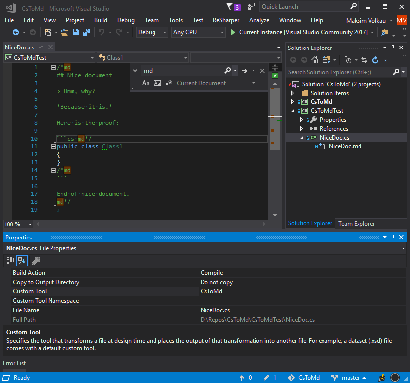

# CsToMd
- [CsToMd](#cstomd)
  - [The Idea](#the-idea)
  - [Visual Studio extension](#visual-studio-extension)
    - [How to use](#how-to-use)

## The Idea

The idea is to have a normal C# .cs file with the special comments `/*md`, `md*/`, and `//md` which will be stripped when converting the file into the respective Markdown .md file. There are couple of additional features but this is basically it. 

Now you have **the documentation always up-to-date with the runnable samples** in the normal .NET Test library project with NUnit, XUnit, etc.

You may check the DryIoc [documentation project](https://github.com/dadhi/DryIoc/tree/master/docs/DryIoc.Docs) for the real-world case example.

The additional features:

- Directive to automatically wrap code in code fence with the optional language, e.g. add `//md code:csharp`, or just `//md code:` to add fences, and `//md code:--` to stop adding fences. The directive may be used multiple times through the file.
- Converting the section outlined with `//md{` and `//md}` comments into the [collapsed markdown details](https://gist.github.com/pierrejoubert73/902cc94d79424356a8d20be2b382e1ab).
- The optional `cstomd.config` file in the folder with the lines starters to be removed completely from the generated documentation file.

## Visual Studio extension

This extension for Visual Studio 2019+ contains the CustomTool File Generator.

When applied to the C# source file it looks like this:

The generated result:

### How to use

- Install [the extension](https://marketplace.visualstudio.com/items?itemName=dadhi.cstomd123) directly from the markerplace in Visual Studio or download the extension vsix file from the [release page](https://github.com/dadhi/CsToMd/releases).
- In properties of your .cs file set the `CustomTool` property to `CsToMd`.
- Save the .cs file
- Check the generated .md file under the .cs file in Solution Explorer 
