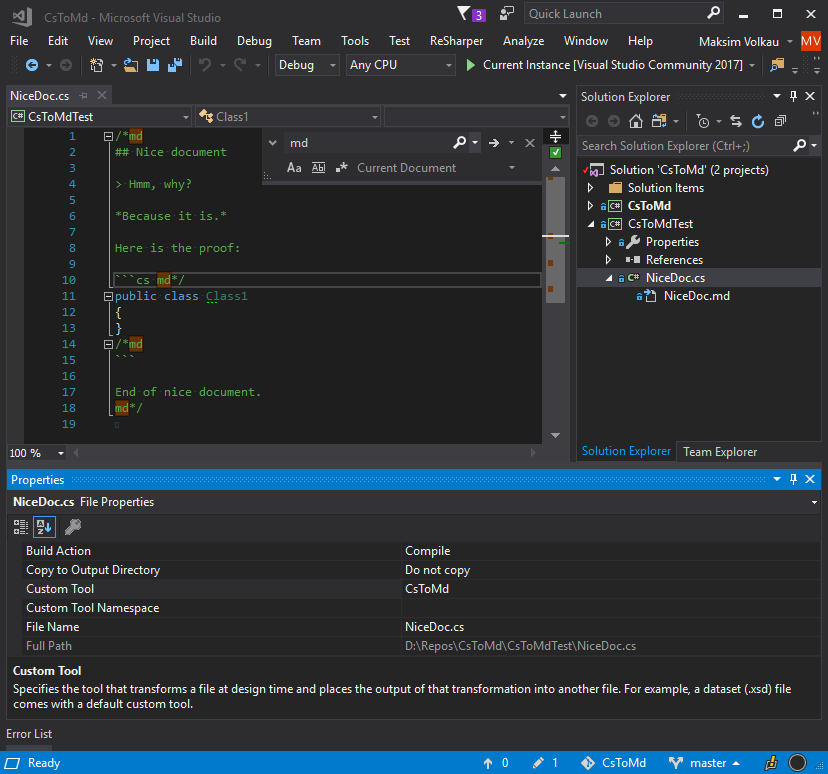
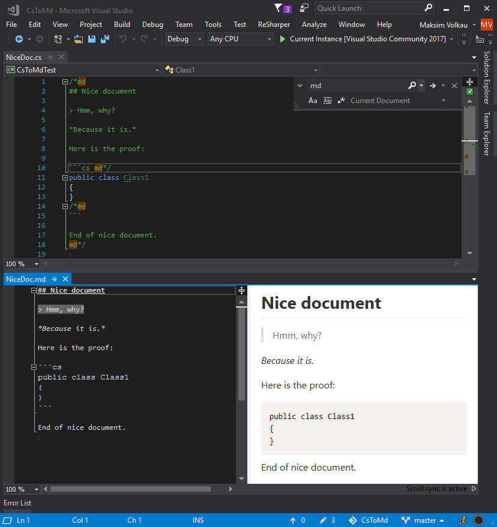

## CsToMd

Visual Studio extension to generate a Markdown .md documentation file from the C# .cs file stripping the special symbol comments.

This VSIX extension for Visual Studio 2017 contains a CustomTool File Generator, 
which generates a markdown file from the .cs file by stripping the comments `/*md` and `md*/`.

**The tool helps to turn your C# file with markdown comments into documentation file with runnable examples and what not.**

### How it looks

### The result

### How to use

- Clone this repo, compile *CsToMd* project, find the *CsToMd.vsix* in output and install it.   
__Or simply install__ a `vsix` extension from the [release](https://github.com/dadhi/CsToMd/releases/tag/1.0.0-preview-01).
- In properties of you .cs file set the property `CustomTool` to `CsToMd`. 
- Save the .cs file with `/*md` and `md*/` commnents in it. 
- Check the generated .md file under the .cs file in Solution Explorer

Play with the example project *CsToMdTest* in this repo to see how it works.

**That's all for now.. Stay tuned ;-)**
